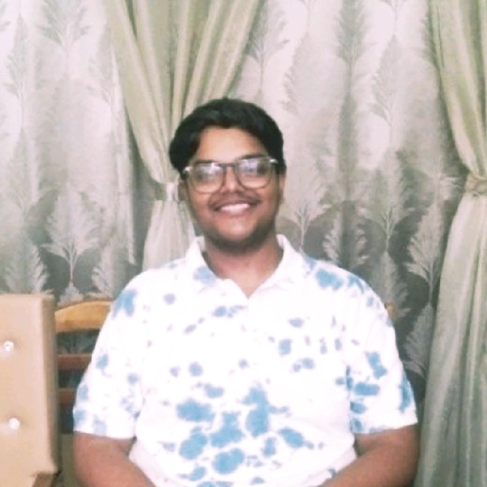

  

    <h1>Parth Sarthi</h1>
    
<strong>Technical Animator & Gameplay Programmer</strong>

    
📍 Muzaffarpur, Bihar, India 
    📧 parthsarthi1208@gmail.com 
    📱 +91 7506087041 
    🔗 <a href="https://www.linkedin.com/in/parth-sarthi-9a1143289">LinkedIn</a> 
    🌐 <a href="https://braga1913.github.io/portfolio-site/">Portfolio</a>

  

  

    
  

---
## Professional Summary

Passionate animation programmer and technical animator with expertise in creating cutting-edge animation systems, procedural animation tools, and performative animation pipelines. Specialized in bridging the gap between artistic vision and technical implementation.

---
## Core Skills

**Programming Languages:** Python, C#, C++  
**Game Engines:** Unreal Engine, Unity  
**3D Software:** Blender, Maya, ZBrush, Houdini, MotionBuilder, Cascadeur  
**Design Tools:** Photoshop, Substance Painter, Marvelous Designer  
**Specializations:** VFX, Rigging, Game Audio, Animation Systems  
**Audio:** FL Studio  

---
## Professional Experience

### Animation Programmer & Plugin Developer
**Rifflix** | 2025 - Present
- Developed animation tools and pipelines that were used to make an automated episode generation system using AI in Unreal Engine
- Created innovative solutions for AI-driven content generation
- Implemented cutting-edge animation workflows

### Lead Animation Director & Lead Gameplay and AI Programmer
**Shader Labs** | 2023 - 2025
- Developed animation tools and pipelines, implemented runtime animation systems
- Made AAA quality animations for the Game 'Baoli'
- Led animation direction and gameplay programming initiatives
- Integrated AI systems for enhanced gameplay experiences

### Specialist Instructor
**India Game Lab** | 2024 - 2025
- Instructed character rigging and animation in Blender, Cascadeur & Unreal Engine
- Taught animation production with technical solutions
- Mentored students in advanced animation techniques
- Developed curriculum for technical animation courses

---
## Education

### Professional Certificate - Unreal Engine Generalist
**India Game Lab** | 2022 - 2024
- Specialized in Unreal Engine, C++, Blueprint, Python
- Advanced training in Lighting, Clothing, Multiplayer, Sound design
- Expertise in VFX, Texturing, Modeling, and Animation

### Certificate Program - Programming
**Various Courses** | 2019 - 2022
- Completed CS50, CS50X, CS50G and various other programming courses
- Built strong foundation in computer science fundamentals
- Developed proficiency in multiple programming languages

### Bachelor of Commerce - BCom, Accounts
**Babasaheb Bhimrao Ambedkar Bihar University** | 2023 - 2026
- Pursuing BCom in Accounts
- Balancing technical expertise with business acumen

---
## Recognition & Awards

### Baoli Featured at India Game Utsav 2025
**ShaderLabs** | 2025
- Baoli, the game I worked on, was featured at India Game Utsav 2025
- Contributed to a nationally recognized gaming project

### Best Instructor of the Year
**India Game Lab** | 2024
- Awarded for having the Most Impact on Students
- Recognized for excellence in technical animation education

### Innovation in Animation Technology with AI
**Rifflix** | 2025
- Honored for developing cutting-edge tools and workflows for animation production with AI
- Recognized for pioneering work in AI-driven animation systems

---
## Technical Expertise

**Animation Systems:**
- Procedural animation development
- Runtime animation systems
- Character rigging and setup
- Optimized motion matching solutions
- Physics-based animations

**Programming:**
- C++ for Unreal Engine
- Python scripting and automation
- Blueprint visual scripting
- Plugin development
- AI integration

**Pipeline Development:**
- Animation tool creation
- Workflow optimization
- Automated rigging systems
- Content generation pipelines
- Quality assurance systems
---
*Last updated: Feburary 2026*
